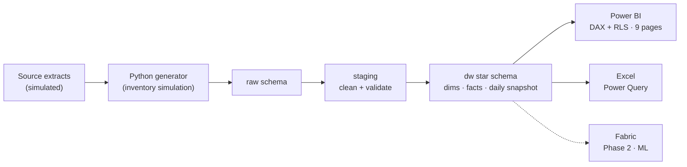

# Retail Inventory Intelligence Platform (RIIP)


> **An end-to-end Business Intelligence solution for retail inventory**  from a simulated PostgreSQL data warehouse through SQL, Python, Excel, and a Power BI executive dashboard, delivered as if by a consulting team for a retail client.

**This is a portfolio case study built on synthetic data for a fictional retailer (Meridian Retail Group).** Everything: the data, model, queries, dashboards, and analysis is original and built to production standards, so every design decision is defensible in an interview.

---

## The dashboard


*Executive Overview page, rendered from the live pipeline figures. Eight more pages are specified in [docs/08-power-bi.md](docs/08-power-bi.md).*

---

## The business problem

Meridian Retail Group: **120 stores, 8 warehouses, 250 suppliers, ~50,000 SKUs across 12 categories and 4 regions**: runs inventory from manually-assembled spreadsheets. The result: stock-outs on fast movers, capital trapped in overstock and dead inventory, revenue leakage no one can quantify, and supplier performance discussed anecdotally. RIIP replaces that with one governed, decision-ready platform.

**What the analysis found** (read directly from the data):

- **~$729K working capital trapped** in dead + overstocked inventory (36% of the position)
- **~$1.3M sales estimated lost** to stock-outs ~2.5× the annual carrying cost
- The defining insight: Meridian is **overstocked and out-of-stock at the same time** the signature of an undifferentiated inventory policy
- **Bronze-tier suppliers (18% of the base) drive 42% of stock-outs**  a small, targetable root cause

Full analysis: [docs/09-business-insights.md](docs/09-business-insights.md).

---

## What makes this project different

- **Simulation, not `random()`.** The data comes from a day-by-day inventory *ledger* — stock-outs, dead stock, late deliveries, and seasonality all *emerge* from the mechanics rather than being faked. ([details](docs/04-synthetic-dataset.md))
- **Every query executed.** All **54 business SQL queries** run against the data and return sensible results. validated, not just written.
- **Cross-tool consistency.** SQL, Excel, and Python independently report **$10.4M revenue, 47% margin, 69% OTIF** because they read the same data. That agreement is the integrity proof.
- **Real modelling depth.** A 12-table star schema using all three Kimball fact types, semi-additive inventory handling, and **44 explained DAX measures**.
- **Honest engineering.** Deliberate data-quality issues are injected and cleaned; bugs found during validation are documented and fixed, not hidden.

---

## Architecture



Full architecture: [docs/02-solution-architecture.md](docs/02-solution-architecture.md).

---

## Tech stack

| Layer | Technology |
|---|---|
| Data warehouse | PostgreSQL 15 (star schema, partitioning, BRIN) |
| Data engineering | Python (Pandas, NumPy) — generation, cleaning, validation, EDA |
| Transformation | Power Query (M), SQL views |
| Semantic & BI | Power BI + DAX + Row-Level Security |
| Ad-hoc analysis | Excel: Power Query, pivots, conditional formatting |
| Version control | Git + GitHub (+ Actions) |
| Phase 2 (optional) | Microsoft Fabric (ML forecasting) |

---

## Repository structure

```
retail-inventory-intelligence-platform/
├── README.md
├── LICENSE
├── config/config.yaml            # all generation parameters
├── docs/                         # 10 numbered deliverable docs + guides
├── data/                         # raw / processed / samples (large files git-ignored)
├── src/
│   ├── generator/                # synthetic data simulation
│   ├── etl/                      # cleaning
│   ├── quality/                  # validation + data quality report
│   └── analysis/                 # EDA + automated KPI report
├── sql/                          # 00→05: setup, schema, constraints, views, procs, 54 queries
├── excel/                        # raw / cleaning / analysis workbooks
├── powerbi/                      # DAX measures, theme, dashboard mockups
└── reports/                      # generated DQ / EDA / KPI reports
```

---

## Quick start

```bash
# 1. install
pip install -r requirements.txt

# 2. generate the synthetic dataset (seconds at demo scale)
python -m src.generator.run                 # or --profile full for the 5-year spec

# 3. run the pipeline: clean → validate → data quality report
python -m src.quality.quality_report

# 4. exploratory analysis + automated KPI report
python -m src.analysis.eda
python -m src.analysis.kpi_report

# 5. build the warehouse (PostgreSQL)
#    run sql/00_*.sql → sql/05_*.sql in order, then load data/processed/

# 6. build the dashboard
#    connect Power BI Desktop to the dw schema; follow docs/08-power-bi.md
```

Details: [Installation Guide](docs/installation-guide.md) · [User Guide](docs/user-guide.md).

---

## Documentation

| # | Document | What it covers |
|---|---|---|
| 01 | [Business Requirements](docs/01-business-requirements-document.md) | Objectives, scope, KPIs, stakeholders, risks |
| 02 | [Solution Architecture](docs/02-solution-architecture.md) | Layers, data flow, tech stack, conventions |
| 03 | [Database Design](docs/03-database-design.md) | ER diagram, facts/dims, keys, indexes, data dictionary |
| 04 | [Synthetic Dataset](docs/04-synthetic-dataset.md) | The simulation, behaviour engineering, scaling |
| 05 | [SQL Development](docs/05-sql-development.md) | DDL, views, procedures, 54 business queries |
| 06 | [Excel](docs/06-excel.md) | Raw / cleaning / analysis workbooks, Power Query |
| 07 | [Python](docs/07-python.md) | Cleaning, validation, quality report, EDA, KPIs |
| 08 | [Power BI](docs/08-power-bi.md) | 9 pages, 44 DAX measures, RLS, theme, mobile |
| 09 | [Business Insights](docs/09-business-insights.md) | Problems, root causes, recommendations, impact |
| 10 | Guides | [Installation](docs/installation-guide.md) · [User](docs/user-guide.md) · [Business](docs/business-guide.md) · [Technical](docs/technical-guide.md) · [Screenshots](docs/screenshots-guide.md) · [Future work](docs/future-improvements.md) |

---

## Skills demonstrated

Dimensional modelling (Kimball) · semi-additive measures · PostgreSQL performance (partitioning, BRIN) · advanced SQL (CTEs, window functions, anti-joins) · Python data engineering · synthetic data simulation · data-quality validation · DAX · Power BI (RLS, drillthrough, bookmarks) · Power Query · retail/inventory domain analytics (ABC/XYZ, GMROI, OTIF, turnover) · consulting-style insight & recommendation.

---

## License

Released under the [MIT License](LICENSE). Built with synthetic data; no real company data is used.
