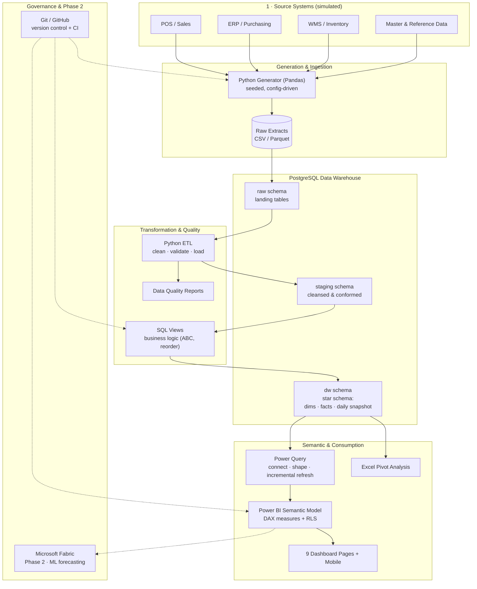

# Solution Architecture
## Retail Inventory Intelligence Platform (RIIP)

| Field | Value |
|---|---|
| **Document** | Solution Architecture |
| **Project** | Retail Inventory Intelligence Platform |
| **Version** | 1.0 |
| **Date** | 25 July 2026 |
| **Status** | Draft for review |
| **Depends on** | BRD v1.0 |

---

## 1. Architecture Principles

Before any boxes and arrows, the design is anchored to five principles. Every decision below traces back to one of them.

1. **Portable core, optional cloud.** The data platform runs on standard PostgreSQL with no proprietary lock-in. Cloud scale (Fabric) is an *optional overlay*, never a dependency.
2. **Single source of truth.** One governed star schema feeds every consumer (Power BI, Excel). No stakeholder builds their own numbers.
3. **Separation of concerns by layer.** Raw, staging, and presentation are physically separated schemas. Nothing reads directly from raw.
4. **Reproducibility over cleverness.** Everything — data generation, transforms, model — is version-controlled, parameterised, and re-runnable from a clean checkout.
5. **Decision-support, not operational control.** The platform informs decisions; source systems (ERP/WMS) remain the systems of record and execution.

---

## 2. High-Level Architecture

RIIP uses a layered ("medallion"-style) architecture adapted to a PostgreSQL + Power BI stack. Data moves left-to-right through five logical layers, each with a single responsibility.

| Layer | Responsibility | Implemented with |
|---|---|---|
| **1. Source** | Systems of record (simulated): POS, ERP/Purchasing, WMS, master data | Python generator → raw extracts |
| **2. Raw / Landing** | Ingest source extracts *as-is*, no transformation | `raw` schema in PostgreSQL |
| **3. Staging / Cleansing** | Type-cast, deduplicate, validate, conform, enforce referential integrity | Python (Pandas) + SQL → `staging` schema |
| **4. Warehouse / Presentation** | The governed star schema: dimensions, facts, daily snapshot | `dw` schema in PostgreSQL |
| **5. Semantic & Consumption** | KPIs, security, and role-based analytics | Power Query → Power BI model (DAX + RLS) → dashboards; Excel |

**Cross-cutting concerns** run alongside all layers: **data quality** (Python validation + DQ reports), **governance** (Git/GitHub, naming standards, documentation), and an **optional Phase-2 ML** capability (Microsoft Fabric) that consumes the warehouse for forecasting.

### 2.1 Why this shape

- **Raw is immutable and cheap to reload.** If a transform is wrong, we fix the code and re-run from raw — we never "repair" data in place. This is what makes the pipeline reproducible.
- **Staging is where trust is created.** Every referential check, dedup, and type fix happens here, so the warehouse layer can *assume* clean, conformed data.
- **The warehouse is the only thing Power BI sees.** BI never touches raw or staging. This is the contract that keeps a single source of truth.

---

## 3. Data Flow (End to End)

1. **Generate.** The Python generator produces referentially-consistent extracts (CSV/Parquet) for every entity, using a fixed seed and `config.yaml` parameters (volumes, date range, engineered anomalies).
2. **Land.** Extracts are bulk-loaded into the `raw` schema, untouched.
3. **Cleanse & conform.** Python + SQL move data from `raw` → `staging`: fix types, trim/standardise text, dedupe, resolve keys, drop or quarantine invalid rows.
4. **Validate.** The data-quality suite runs referential, range, and completeness checks and emits a **Data Quality Report**. A failing gate stops promotion to the warehouse.
5. **Model.** Conformed staging data is loaded into the `dw` star schema. SQL views encapsulate reusable business logic (e.g., ABC classification, reorder signals).
6. **Serve.** Power Query connects to `dw` (import mode with **incremental refresh** on large facts, exploiting **query folding** for efficiency), building the Power BI semantic model.
7. **Secure & measure.** DAX measures implement the KPIs from the BRD; **Row-Level Security** restricts each role to its region/DC.
8. **Consume.** Nine dashboard pages (+ mobile) and Excel pivot workbooks serve executives, regions, DCs, purchasing and finance.
9. **Govern.** Git/GitHub versions all code and DAX; CI can lint SQL and run validation on every change.

---

## 4. Architecture Diagram



> Renders natively on GitHub and in any Mermaid viewer. A rendered PNG (`docs/architecture-diagram.png`) is produced for slide decks and the README in Section 10.

---

## 5. Technology Stack

| Layer | Technology | Purpose | Why chosen |
|---|---|---|---|
| Data warehouse | **PostgreSQL** | Star schema, storage, SQL logic | Open-source, portable, no lock-in; runs locally or in any cloud |
| Data generation | **Python + Pandas / NumPy** | Synthetic data, cleaning, validation, DQ, EDA | Reproducible, testable, version-controlled; one language for engineering + analytics |
| Configuration | **YAML** (`config.yaml`) | Volumes, dates, thresholds, seed | Data volume and business rules are parameters, not hard-coded |
| Last-mile shaping | **Power Query (M)** | Connect to Postgres, incremental refresh, light transforms | Native to Power BI/Excel; query folding pushes work to the DB |
| Semantic model | **Power BI + DAX** | KPIs, relationships, RLS | Industry-standard BI; strong modelling + security |
| Ad-hoc analysis | **Excel + Pivot Tables/Charts** | Finance-style deep dives on the same model | Meets stakeholders where they already work |
| Version control | **Git + GitHub** | Code, SQL, DAX, docs, CI | Portfolio surface + engineering discipline |
| CI/CD (light) | **GitHub Actions** | Lint SQL, run validation on PR | Demonstrates automated quality gates |
| Phase 2 (optional) | **Microsoft Fabric** | Lakehouse scale + ML forecasting | Cloud path when volumes/ML outgrow the core |

### 5.1 Two key stack decisions (interview-ready)

**Why PostgreSQL *and* Fabric?** The core is built on PostgreSQL so it is portable, free to run, and fully reviewable — every business question in the BRD is answerable without cloud. **Fabric is deliberately deferred to Phase 2**, where it earns its place: ML demand forecasting and lakehouse-scale snapshots. Leading with Fabric would add cost and lock-in for zero core-scope benefit. *Choosing the simpler sufficient tool is the senior move.*

**Why Python *and* Power Query?** They do different jobs. **Python** owns the heavy, testable engineering — generation, bulk cleaning, validation, DQ reporting — because it's reproducible and version-controlled. **Power Query** owns the last-mile shaping *inside* the BI tool, exploiting query folding and incremental refresh. This mirrors how real organisations split platform engineering from self-service BI, and it means the same clean warehouse serves both Power BI and Excel.

---

## 6. Repository / Folder Structure

```
retail-inventory-intelligence-platform/
├── README.md
├── LICENSE
├── .gitignore
├── requirements.txt
├── config/
│   └── config.yaml               # volumes, date range, thresholds, seed
│
├── docs/
│   ├── 01-business-requirements-document.md
│   ├── 02-solution-architecture.md
│   ├── architecture-diagram.png
│   ├── data-dictionary.md
│   ├── installation-guide.md
│   ├── user-guide.md
│   ├── business-guide.md
│   ├── technical-guide.md
│   └── screenshots/
│
├── data/
│   ├── raw/                      # generated source extracts (git-ignored)
│   ├── processed/                # cleansed/conformed outputs (git-ignored)
│   └── samples/                  # small committed sample for reviewers
│
├── src/
│   ├── generator/                # synthetic data generation
│   ├── etl/                      # clean · validate · load to Postgres
│   ├── quality/                  # data quality reports
│   └── analysis/                 # EDA + automated KPI report
│
├── sql/
│   ├── 00_database_setup/        # database + schemas + roles
│   ├── 01_schema/                # DDL: dimensions & facts
│   ├── 02_constraints_indexes/   # PKs, FKs, indexes
│   ├── 03_views/                 # business-logic views
│   ├── 04_procedures/            # stored procedures (where justified)
│   └── 05_business_queries/      # the 50+ business questions
│
├── powerbi/
│   ├── RIIP.pbix
│   ├── theme/                    # JSON theme, icons
│   └── measures/                 # documented DAX (source of truth)
│
├── excel/
│   ├── 01_raw_data_workbook.xlsx
│   ├── 02_cleaning_workbook.xlsx
│   └── 03_business_analysis_workbook.xlsx
│
├── notebooks/                    # optional Jupyter EDA
├── tests/                        # data + transform tests
└── .github/
    ├── workflows/                # CI: lint SQL, run validation
    ├── ISSUE_TEMPLATE/
    └── PULL_REQUEST_TEMPLATE.md
```

**Design rationale:**

- **Numbered SQL folders (`00_`→`05_`)** encode execution order — anyone can run the build top-to-bottom without guessing dependencies.
- **`data/` is git-ignored except `samples/`** — large generated files never bloat the repo, but a reviewer still gets runnable sample data on clone.
- **DAX lives in `powerbi/measures/` as text** — the `.pbix` is a binary blob Git can't diff, so the *authoritative, reviewable* copy of every measure is version-controlled as text.
- **`config/config.yaml` centralises every tunable** — volumes, dates, seed, and business thresholds (carrying-cost rate, dead-stock days) live in one place, not scattered across scripts.

---

## 7. Naming Conventions

Consistent naming is what makes a codebase feel professional rather than assembled. These conventions apply throughout.

### 7.1 Database

| Object | Convention | Example |
|---|---|---|
| Schema | lowercase, purpose-named | `raw`, `staging`, `dw` |
| Dimension table | `dim_` + singular noun | `dim_product`, `dim_supplier` |
| Fact table | `fact_` + grain noun | `fact_sales`, `fact_inventory_snapshot` |
| Surrogate key | `<entity>_key` (integer, warehouse-generated) | `product_key` |
| Business/natural key | `<entity>_id` or domain term | `product_id`, `sku` |
| Date column | `_date` suffix | `order_date`, `snapshot_date` |
| Amount/value column | `_amount` / `_value` / `_cost` suffix | `sales_amount`, `inventory_value` |
| Quantity column | `_qty` suffix | `units_sold_qty` |
| Boolean flag | `is_` / `has_` prefix | `is_active`, `has_returned` |

### 7.2 SQL objects

| Object | Convention | Example |
|---|---|---|
| View | `vw_` prefix | `vw_reorder_recommendations` |
| Stored procedure | `usp_` prefix | `usp_refresh_inventory_snapshot` |
| Index | `idx_<table>_<cols>` | `idx_fact_sales_product_key` |
| Primary key | `pk_<table>` | `pk_dim_product` |
| Foreign key | `fk_<table>_<ref>` | `fk_fact_sales_product` |
| Unique constraint | `uq_<table>_<cols>` | `uq_dim_product_sku` |
| Check constraint | `ck_<table>_<rule>` | `ck_fact_sales_qty_positive` |

### 7.3 Power BI

| Object | Convention | Example |
|---|---|---|
| Measure | Title Case, business-friendly | `Inventory Turnover`, `Estimated Lost Sales` |
| Measure organisation | Dedicated `_Measures` table + display folders | `Inventory Health\GMROI` |
| Calculation group | PascalCase | `TimeIntelligence` |
| RLS role | `RLS_<scope>` | `RLS_Region`, `RLS_Warehouse` |
| Column | Space-separated, human-readable | `Product Name`, `Snapshot Date` |

### 7.4 Files, Python, Git

| Item | Convention | Example |
|---|---|---|
| Python module | `snake_case.py` | `generate_sales.py` |
| Doc / markdown | `NN-kebab-case.md` | `03-database-design.md` |
| SQL script | `NN_snake_case.sql` | `01_create_dim_product.sql` |
| Git branch | `type/short-description` | `feature/inventory-snapshot`, `fix/orphan-keys` |
| Commit message | Conventional Commits | `feat: add daily inventory snapshot generator` |

> **Why enforce conventions this hard?** In an interview, a reviewer skims the repo before they read a word of your README. Uniform `dim_`/`fact_` naming, numbered run order, and conventional commits signal "this person has worked on a real team" faster than any paragraph can.

---

## 8. Deployment & Environments (lightweight)

For a portfolio build we keep this simple but honest:

- **Local development** — PostgreSQL + Power BI Desktop on the developer machine; the default is fully runnable offline.
- **Config-driven promotion** — the same scripts run against a larger dataset (change `config.yaml`) to simulate a "production-scale" environment for performance testing.
- **CI on GitHub** — Actions lint SQL and run the Python validation suite on every pull request, so `main` always builds.

*(A full multi-environment CI/CD pipeline is noted as a Future Enhancement — appropriate for a real client, over-engineered for a portfolio core.)*

---

## 9. How This Maps to the BRD

| BRD requirement | Architectural answer |
|---|---|
| Single source of truth (BO-6) | One `dw` star schema; BI never reads raw/staging |
| Daily snapshot / semi-additive inventory (FR-2, R-5) | `fact_inventory_snapshot` at stocked SKU-location-day grain |
| RLS by region/role (FR-8, NFR-4) | `RLS_Region` / `RLS_Warehouse` roles in the semantic model |
| Scale to 2–3 yrs of snapshots (NFR-2) | Incremental refresh + partitioning + config-driven volume |
| Daily refresh SLA (NFR-3) | Scheduled refresh; CI-validated transforms; last-good fallback |
| Data quality ≥ 99% (NFR-5) | Python validation gate + Data Quality Report before promotion |
| Portability / no lock-in (NFR-8) | Standard PostgreSQL core; Fabric optional Phase 2 only |

---

*End of Solution Architecture v1.0.*
