# Database Design
## Retail Inventory Intelligence Platform (RIIP)

| Field | Value |
|---|---|
| **Document** | Database Design |
| **Project** | Retail Inventory Intelligence Platform |
| **Version** | 1.0 |
| **Date** | 25 July 2026 |
| **Status** | Draft for review |
| **Depends on** | BRD v1.0, Solution Architecture v1.0 |
| **Target engine** | PostgreSQL 15+ |

---

## 1. Modelling Approach

The warehouse (`dw` schema) is a **Kimball-style dimensional model** — a set of star schemas sharing conformed dimensions. This is a deliberate choice over a normalised (3NF) design, and the reasoning is the single most important thing to be able to defend:

> **OLTP is normalised to protect writes. OLAP is denormalised to accelerate reads.** Source systems (POS, ERP, WMS) use 3NF to prevent update anomalies when thousands of transactions hit per second. A BI warehouse has the opposite job: few writers, many readers asking aggregate questions. So we denormalise into wide dimensions and narrow facts, trading some storage and redundancy for query speed and human readability. Analysts should be able to read the model, not decode it.

The pipeline therefore changes shape as data moves:

| Layer | Model style | Why |
|---|---|---|
| `raw` | mirrors source (as-is) | faithful landing, reloadable |
| `staging` | ~3NF, conformed | cleansing, dedup, referential repair |
| `dw` | **star schema (denormalised)** | fast, readable analytics |

This document specifies the **`dw` layer** — the model Power BI and Excel consume.

---

## 2. Grain Declarations

In dimensional modelling, *declaring the grain first* is non-negotiable — the grain is the contract for what one row means. Every fact below states its grain before anything else.

| Fact table | **Grain (one row =)** | Fact type |
|---|---|---|
| `fact_sales` | one **sales order line** | Transaction |
| `fact_inventory_snapshot` | one **product × location × day** | **Periodic snapshot (semi-additive)** |
| `fact_purchase_order` | one **PO line**, updated through its lifecycle | **Accumulating snapshot** |
| `fact_returns` | one **return line** | Transaction |
| `fact_stock_transfer` | one **transfer line** (from → to location) | Transaction |

These three fact *types* — transaction, periodic snapshot, accumulating snapshot — are the three canonical Kimball patterns, and this model uses all three intentionally. That's a strong interview talking point: you didn't just build tables, you chose the right *kind* of fact for each business process.

---

## 3. ER Diagram

```mermaid
erDiagram
    dim_date            ||--o{ fact_sales              : "sale date"
    dim_product         ||--o{ fact_sales              : ""
    dim_location        ||--o{ fact_sales              : "store"
    dim_customer        ||--o{ fact_sales              : ""
    dim_employee        ||--o{ fact_sales              : ""
    dim_promotion       ||--o{ fact_sales              : ""

    dim_date            ||--o{ fact_inventory_snapshot : "snapshot date"
    dim_product         ||--o{ fact_inventory_snapshot : ""
    dim_location        ||--o{ fact_inventory_snapshot : ""

    dim_date            ||--o{ fact_purchase_order     : "order date"
    dim_product         ||--o{ fact_purchase_order     : ""
    dim_supplier        ||--o{ fact_purchase_order     : ""
    dim_location        ||--o{ fact_purchase_order     : "destination"

    dim_date            ||--o{ fact_returns            : "return date"
    dim_product         ||--o{ fact_returns            : ""
    dim_location        ||--o{ fact_returns            : ""
    dim_customer        ||--o{ fact_returns            : ""

    dim_date            ||--o{ fact_stock_transfer     : "transfer date"
    dim_product         ||--o{ fact_stock_transfer     : ""
    dim_location        ||--o{ fact_stock_transfer     : "source"
    dim_location        ||--o{ fact_stock_transfer     : "destination"

    dim_date {
        int date_key PK
        date full_date
        int year
        int month_number
        varchar season
        boolean is_weekend
        boolean is_holiday
    }
    dim_product {
        int product_key PK
        varchar sku UK
        varchar product_name
        varchar category
        varchar subcategory
        numeric unit_cost
        numeric unit_price
        char abc_class
        char xyz_class
        boolean is_active
    }
    dim_location {
        int location_key PK
        varchar location_id UK
        varchar location_type
        varchar location_name
        varchar region
        int store_size_sqft
        boolean is_active
    }
    dim_supplier {
        int supplier_key PK
        varchar supplier_id UK
        varchar supplier_name
        varchar country
        varchar reliability_tier
        boolean is_active
    }
    dim_customer {
        int customer_key PK
        varchar customer_id UK
        varchar loyalty_tier
        varchar region
        boolean is_loyalty_member
    }
    dim_employee {
        int employee_key PK
        varchar employee_id UK
        varchar employee_name
        varchar role
        int home_location_key FK
    }
    dim_promotion {
        int promotion_key PK
        varchar promotion_id UK
        varchar promotion_name
        varchar promotion_type
        numeric discount_pct
        date start_date
        date end_date
    }
    fact_sales {
        bigint sales_key PK
        varchar order_id
        int date_key FK
        int product_key FK
        int location_key FK
        int customer_key FK
        int employee_key FK
        int promotion_key FK
        int units_sold_qty
        numeric net_sales_amount
        numeric cogs_amount
        numeric gross_margin_amount
    }
    fact_inventory_snapshot {
        bigint snapshot_key PK
        int snapshot_date_key FK
        int product_key FK
        int location_key FK
        int on_hand_qty
        numeric on_hand_value
        int on_order_qty
        int reorder_point
        int safety_stock_qty
        boolean is_stockout_flag
    }
    fact_purchase_order {
        bigint po_line_key PK
        varchar po_number
        int order_date_key FK
        int expected_date_key FK
        int received_date_key FK
        int product_key FK
        int supplier_key FK
        int dest_location_key FK
        int ordered_qty
        int received_qty
        int lead_time_days
        boolean is_otif_flag
    }
    fact_returns {
        bigint return_key PK
        varchar return_id
        int return_date_key FK
        int product_key FK
        int location_key FK
        int customer_key FK
        int returned_qty
        numeric refund_amount
        varchar return_reason_code
    }
    fact_stock_transfer {
        bigint transfer_key PK
        varchar transfer_id
        int transfer_date_key FK
        int product_key FK
        int source_location_key FK
        int dest_location_key FK
        int transfer_qty
        numeric transfer_cost
    }
```

---

## 4. Key Design Decisions (each justified)

### 4.1 Unified `dim_location` instead of separate store/warehouse dimensions

**Decision:** one `dim_location` with `location_type ∈ {STORE, WAREHOUSE}`, not a `dim_store` + `dim_warehouse` pair.

**Why:** inventory physically lives at *both* stores and DCs, and transfers move stock *between* them. With two separate dimensions, `fact_inventory_snapshot` and `fact_stock_transfer` would each need awkward "either/or" foreign keys. One location dimension makes those facts clean, lets `fact_stock_transfer` role-play the same dimension as **source** and **destination**, and makes "total network inventory" a one-line query. The store-only and warehouse-only dashboard pages simply filter on `location_type`.

**Trade-off accepted:** stores and warehouses have some non-shared attributes (e.g., `store_size_sqft` vs `warehouse_capacity_units`); these are nullable per type. That mild sparsity is a small price for a much cleaner fact layer.

### 4.2 Role-playing dimensions

Two dimensions play multiple roles:

- **`dim_date`** — appears as sale date, snapshot date, PO order/expected/received dates, return date, transfer date. Modelled once; referenced by multiple FKs. In Power BI this is handled with multiple relationships + `USERELATIONSHIP`, or role-play copies where needed.
- **`dim_location`** — plays **source** and **destination** in `fact_stock_transfer`, and **store** vs **destination** across sales/PO facts.

Role-playing avoids duplicating dimension data and is the textbook Kimball solution — worth naming explicitly in an interview.

### 4.3 Three fact *types*, chosen on purpose

- **Transaction facts** (`fact_sales`, `fact_returns`, `fact_stock_transfer`) — one immutable row per event; additive measures.
- **Periodic snapshot** (`fact_inventory_snapshot`) — the state of inventory captured daily. **On-hand is semi-additive**: you can sum it across products and locations, but **never across dates** (summing Monday + Tuesday stock is meaningless). DAX handles this with `LASTNONBLANKVALUE` / closing-balance patterns. This is *the* defining inventory-BI concept.
- **Accumulating snapshot** (`fact_purchase_order`) — one row per PO line whose date columns (order → expected → received) fill in as the PO progresses, enabling lead-time, lateness, and OTIF measurement in a single row.

### 4.4 Surrogate keys everywhere

Every dimension has an integer **surrogate key** (`*_key`, generated by the warehouse) as its PK, separate from the **business/natural key** (`sku`, `supplier_id`) carried as a unique column.

**Why surrogates:** they decouple the warehouse from source-system key changes, are compact and fast to join, gracefully handle "unknown"/late-arriving members (a `-1` key), and are a prerequisite for **Slowly Changing Dimensions**. Joining facts on integers rather than long text keys is measurably faster at scale.

### 4.5 Degenerate dimensions

`order_id`, `po_number`, `return_id`, `transfer_id` live **inside the fact tables**, not in their own dimensions. They have no descriptive attributes — they exist only to group lines into a transaction (e.g., reconstruct a basket). Storing them as degenerate dimensions is the correct pattern and avoids pointless single-column dimension tables.

### 4.6 Slowly Changing Dimensions (SCD)

Default is **SCD Type 1 (overwrite)** for simplicity. Two attributes are flagged for **potential Type 2 (history-tracking)**: `dim_product.unit_cost` and supplier assignment — because historical inventory *valuation* should ideally use the cost that applied at the time. For the portfolio build we document this as a known, deliberate simplification with a clear upgrade path, which is more honest (and more impressive) than pretending it doesn't matter.

### 4.7 Data quality by construction + deliberate dirt

Referential integrity is enforced with real FKs in the `dw` layer, so orphan rows are impossible there. The **missing values and duplicates** you specified are injected upstream in `raw`, cleaned in `staging`, and documented — so the cleaning and validation deliverables have genuine work to do and the Data Quality Report is verifiable rather than theatrical.

---

## 5. Primary Keys, Foreign Keys, Relationships

| Table | Primary key | Foreign keys → referenced dimension |
|---|---|---|
| `dim_date` | `date_key` | — |
| `dim_product` | `product_key` | — |
| `dim_location` | `location_key` | `home` self-ref not used |
| `dim_supplier` | `supplier_key` | — |
| `dim_customer` | `customer_key` | — |
| `dim_employee` | `employee_key` | `home_location_key` → `dim_location` |
| `dim_promotion` | `promotion_key` | — |
| `fact_sales` | `sales_key` | date, product, location, customer, employee, promotion |
| `fact_inventory_snapshot` | `snapshot_key` | snapshot_date, product, location |
| `fact_purchase_order` | `po_line_key` | order/expected/received date, product, supplier, dest_location |
| `fact_returns` | `return_key` | return_date, product, location, customer |
| `fact_stock_transfer` | `transfer_key` | transfer_date, product, source_location, dest_location |

**Cardinality:** every relationship is **one-to-many** (dimension → fact), single-direction filtering (dimensions filter facts). No many-to-many; no bidirectional filters (they invite ambiguity and performance issues).

---

## 6. Indexing Strategy

| Index | Table.Columns | Type | Purpose |
|---|---|---|---|
| PK indexes | all `*_key` PKs | B-tree (implicit) | uniqueness + point lookups |
| Natural-key uniques | `dim_product.sku`, `dim_supplier.supplier_id`, `dim_location.location_id` | Unique B-tree | enforce business keys, dedup |
| FK join indexes | every fact FK column (`product_key`, `location_key`, `date_key`, …) | B-tree | fast dimension joins |
| Snapshot composite | `fact_inventory_snapshot (location_key, product_key, snapshot_date_key)` | B-tree | the dominant inventory query path |
| Sales composite | `fact_sales (date_key, product_key)` | B-tree | time-sliced product analysis |
| Date range (big facts) | `fact_inventory_snapshot.snapshot_date_key`, `fact_sales.date_key` | **BRIN** | tiny, efficient index for append-only, time-ordered data |
| Partial index | `fact_inventory_snapshot (product_key) WHERE is_stockout_flag` | Partial B-tree | fast exception queries on a small subset |

**Partitioning:** `fact_inventory_snapshot` uses **PostgreSQL declarative range partitioning by month** on `snapshot_date_key`. This keeps queries pruning to relevant months, makes retention (drop old partitions) trivial, and directly answers the snapshot-volume risk (R-2) from the BRD. `fact_sales` may be partitioned by year given the 5-year span.

**Retention:** daily snapshots for the most recent rolling window; older history retained at month-end grain. This is a real retailer pattern and keeps the largest fact table in the tens-of-millions range rather than billions.

> **Indexing philosophy:** index the join and filter columns queries actually use, not every column. Over-indexing slows the daily load (every insert maintains every index) for read gains nobody uses. BRIN on the huge time-ordered facts is the standout choice here — it's a fraction of the size of a B-tree and perfect for append-only snapshot data.

---

## 7. Data Dictionary (dw layer)

### 7.1 Dimensions

**`dim_date`**

| Column | Type | Key | Description |
|---|---|---|---|
| date_key | INT | PK | Surrogate in `YYYYMMDD` form (e.g., 20250131) |
| full_date | DATE | | Calendar date |
| day_of_week / day_name | INT / VARCHAR | | 1–7 and Mon–Sun |
| is_weekend | BOOLEAN | | Weekend flag (drives weekend demand analysis) |
| week_of_year | INT | | ISO week |
| month_number / month_name | INT / VARCHAR | | 1–12 and Jan–Dec |
| quarter / year | INT / INT | | Calendar quarter and year |
| fiscal_year / fiscal_quarter | INT / VARCHAR | | Fiscal calendar (config-defined start) |
| season | VARCHAR | | Spring/Summer/Autumn/Winter — powers seasonality views |
| is_holiday / holiday_name | BOOLEAN / VARCHAR | | Holiday flag and label |

**`dim_product`**

| Column | Type | Key | Description |
|---|---|---|---|
| product_key | INT | PK | Surrogate key |
| sku | VARCHAR | UK | Business key (natural) |
| product_name | VARCHAR | | Display name |
| category / subcategory | VARCHAR | | 12 categories / ~60 subcategories (denormalised hierarchy) |
| brand | VARCHAR | | Brand label |
| unit_cost | NUMERIC(12,2) | | Standard cost (SCD Type-2 candidate) |
| unit_price | NUMERIC(12,2) | | List price |
| standard_margin_pct | NUMERIC(5,2) | | (price − cost) / price |
| abc_class | CHAR(1) | | A/B/C by revenue contribution (Pareto) |
| xyz_class | CHAR(1) | | X/Y/Z by demand variability |
| launch_date / discontinue_date | DATE | | Lifecycle dates (nullable) |
| is_active | BOOLEAN | | Currently sellable |

**`dim_location`**

| Column | Type | Key | Description |
|---|---|---|---|
| location_key | INT | PK | Surrogate key |
| location_id | VARCHAR | UK | Business key |
| location_type | VARCHAR | | STORE or WAREHOUSE |
| location_name | VARCHAR | | Display name |
| region | VARCHAR | | One of 4 sales regions (RLS driver) |
| city / state | VARCHAR | | Geography |
| store_size_sqft | INT | | Store selling area (null for warehouses) |
| store_format | VARCHAR | | e.g., Flagship/Standard/Express (null for warehouses) |
| warehouse_capacity_units | INT | | DC capacity (null for stores) |
| open_date | DATE | | Location open date |
| is_active | BOOLEAN | | Operational flag |

**`dim_supplier`**

| Column | Type | Key | Description |
|---|---|---|---|
| supplier_key | INT | PK | Surrogate key |
| supplier_id | VARCHAR | UK | Business key |
| supplier_name | VARCHAR | | Display name |
| country | VARCHAR | | Sourcing country |
| region | VARCHAR | | Supplier region |
| category_specialisation | VARCHAR | | Primary category supplied |
| reliability_tier | VARCHAR | | Assigned tier (Gold/Silver/Bronze) — realism seed for OTIF spread |
| contract_start_date | DATE | | Relationship start |
| is_active | BOOLEAN | | Active supplier flag |

**`dim_customer`** (lightweight, anonymised — no PII)

| Column | Type | Key | Description |
|---|---|---|---|
| customer_key | INT | PK | Surrogate key |
| customer_id | VARCHAR | UK | Anonymised business key |
| loyalty_tier | VARCHAR | | None/Silver/Gold |
| is_loyalty_member | BOOLEAN | | Loyalty flag |
| region | VARCHAR | | Customer region |
| signup_date | DATE | | First-seen date |

**`dim_employee`**

| Column | Type | Key | Description |
|---|---|---|---|
| employee_key | INT | PK | Surrogate key |
| employee_id | VARCHAR | UK | Business key |
| employee_name | VARCHAR | | Synthetic name (no real PII) |
| role | VARCHAR | | e.g., Cashier/Manager |
| home_location_key | INT | FK | → `dim_location` |
| hire_date | DATE | | Employment start |
| is_active | BOOLEAN | | Current employee flag |

**`dim_promotion`**

| Column | Type | Key | Description |
|---|---|---|---|
| promotion_key | INT | PK | Surrogate key |
| promotion_id | VARCHAR | UK | Business key |
| promotion_name | VARCHAR | | Campaign name |
| promotion_type | VARCHAR | | PERCENT_OFF / BOGO / MARKDOWN / BUNDLE |
| discount_pct | NUMERIC(5,2) | | Effective discount |
| applies_to_level | VARCHAR | | SKU / CATEGORY / STORE |
| start_date / end_date | DATE | | Promo window |
| is_active | BOOLEAN | | Active flag |

### 7.2 Facts

**`fact_sales`** — grain: one sales order line

| Column | Type | Key | Description |
|---|---|---|---|
| sales_key | BIGINT | PK | Surrogate key |
| order_id | VARCHAR | (degenerate) | Groups lines into a basket |
| date_key | INT | FK | → `dim_date` (sale date) |
| product_key | INT | FK | → `dim_product` |
| location_key | INT | FK | → `dim_location` (store) |
| customer_key | INT | FK | → `dim_customer` |
| employee_key | INT | FK | → `dim_employee` |
| promotion_key | INT | FK | → `dim_promotion` (nullable → "no promo" member) |
| units_sold_qty | INT | | Units on the line |
| unit_price | NUMERIC(12,2) | | Price applied |
| gross_sales_amount | NUMERIC(14,2) | | qty × price before discount |
| discount_amount | NUMERIC(14,2) | | Promo/markdown discount |
| net_sales_amount | NUMERIC(14,2) | | Revenue after discount |
| unit_cost | NUMERIC(12,2) | | Cost at time of sale |
| cogs_amount | NUMERIC(14,2) | | qty × unit_cost |
| gross_margin_amount | NUMERIC(14,2) | | net_sales − cogs |

**`fact_inventory_snapshot`** — grain: product × location × day (semi-additive)

| Column | Type | Key | Description |
|---|---|---|---|
| snapshot_key | BIGINT | PK | Surrogate key |
| snapshot_date_key | INT | FK | → `dim_date` (partition key) |
| product_key | INT | FK | → `dim_product` |
| location_key | INT | FK | → `dim_location` |
| on_hand_qty | INT | | Units on hand (semi-additive) |
| on_hand_value | NUMERIC(14,2) | | on_hand_qty × unit_cost |
| on_order_qty | INT | | Units on open POs |
| reorder_point | INT | | Reorder trigger level |
| safety_stock_qty | INT | | Buffer stock |
| days_of_supply | NUMERIC(8,2) | | on_hand ÷ avg daily demand |
| is_below_reorder_flag | BOOLEAN | | on_hand ≤ reorder_point |
| is_stockout_flag | BOOLEAN | | on_hand = 0 |

**`fact_purchase_order`** — grain: one PO line (accumulating snapshot)

| Column | Type | Key | Description |
|---|---|---|---|
| po_line_key | BIGINT | PK | Surrogate key |
| po_number | VARCHAR | (degenerate) | Groups lines into a PO |
| order_date_key | INT | FK | → `dim_date` (ordered) |
| expected_date_key | INT | FK | → `dim_date` (promised) |
| received_date_key | INT | FK | → `dim_date` (received; null until receipt) |
| product_key | INT | FK | → `dim_product` |
| supplier_key | INT | FK | → `dim_supplier` |
| dest_location_key | INT | FK | → `dim_location` (receiving DC/store) |
| ordered_qty | INT | | Units ordered |
| received_qty | INT | | Units received |
| unit_cost | NUMERIC(12,2) | | PO unit cost |
| po_line_amount | NUMERIC(14,2) | | ordered_qty × unit_cost |
| lead_time_days | INT | | received − ordered |
| is_late_flag | BOOLEAN | | received_date > expected_date |
| is_complete_flag | BOOLEAN | | received_qty ≥ ordered_qty |
| is_otif_flag | BOOLEAN | | on time AND in full |

**`fact_returns`** — grain: one return line

| Column | Type | Key | Description |
|---|---|---|---|
| return_key | BIGINT | PK | Surrogate key |
| return_id | VARCHAR | (degenerate) | Return document id |
| return_date_key | INT | FK | → `dim_date` |
| product_key | INT | FK | → `dim_product` |
| location_key | INT | FK | → `dim_location` |
| customer_key | INT | FK | → `dim_customer` |
| original_order_id | VARCHAR | | Links back to the sale (degenerate ref) |
| returned_qty | INT | | Units returned |
| refund_amount | NUMERIC(14,2) | | Refund value |
| return_reason_code | VARCHAR | | Defective/Wrong-item/Unwanted/… |

**`fact_stock_transfer`** — grain: one transfer line

| Column | Type | Key | Description |
|---|---|---|---|
| transfer_key | BIGINT | PK | Surrogate key |
| transfer_id | VARCHAR | (degenerate) | Transfer document id |
| transfer_date_key | INT | FK | → `dim_date` |
| product_key | INT | FK | → `dim_product` |
| source_location_key | INT | FK | → `dim_location` (from) |
| dest_location_key | INT | FK | → `dim_location` (to) |
| transfer_qty | INT | | Units moved |
| transfer_cost | NUMERIC(14,2) | | Movement cost |

---

## 8. How the Model Answers the Business Questions

| BRD question | Tables involved |
|---|---|
| Stock-out risk / reorder | `fact_inventory_snapshot` + `dim_product` + `dim_location` |
| Trapped capital (excess/dead) | `fact_inventory_snapshot` + `fact_sales` (movement) |
| Turnover / DIO / GMROI | `fact_sales` (COGS, margin) + `fact_inventory_snapshot` (avg inventory) |
| Supplier OTIF / lead time | `fact_purchase_order` + `dim_supplier` |
| Revenue leakage | `fact_sales` (discounts) + `fact_returns` + snapshot (stock-out lost sales) |
| Store/region performance | `fact_sales` + `dim_location` (region) |
| Declining products | `fact_sales` trend + `dim_product` |
| Warehouse holding cost | `fact_inventory_snapshot` + `dim_location` (type=WAREHOUSE) |
| Network rebalancing | `fact_stock_transfer` (role-played locations) |
| Promotion effectiveness | `fact_sales` + `dim_promotion` |

Every BRD question maps cleanly onto the model — confirmation that the grain and dimension choices are correct.

---

*End of Database Design v1.0. The physical DDL (CREATE statements, constraints, indexes, partitions) is delivered in Section 5.*
