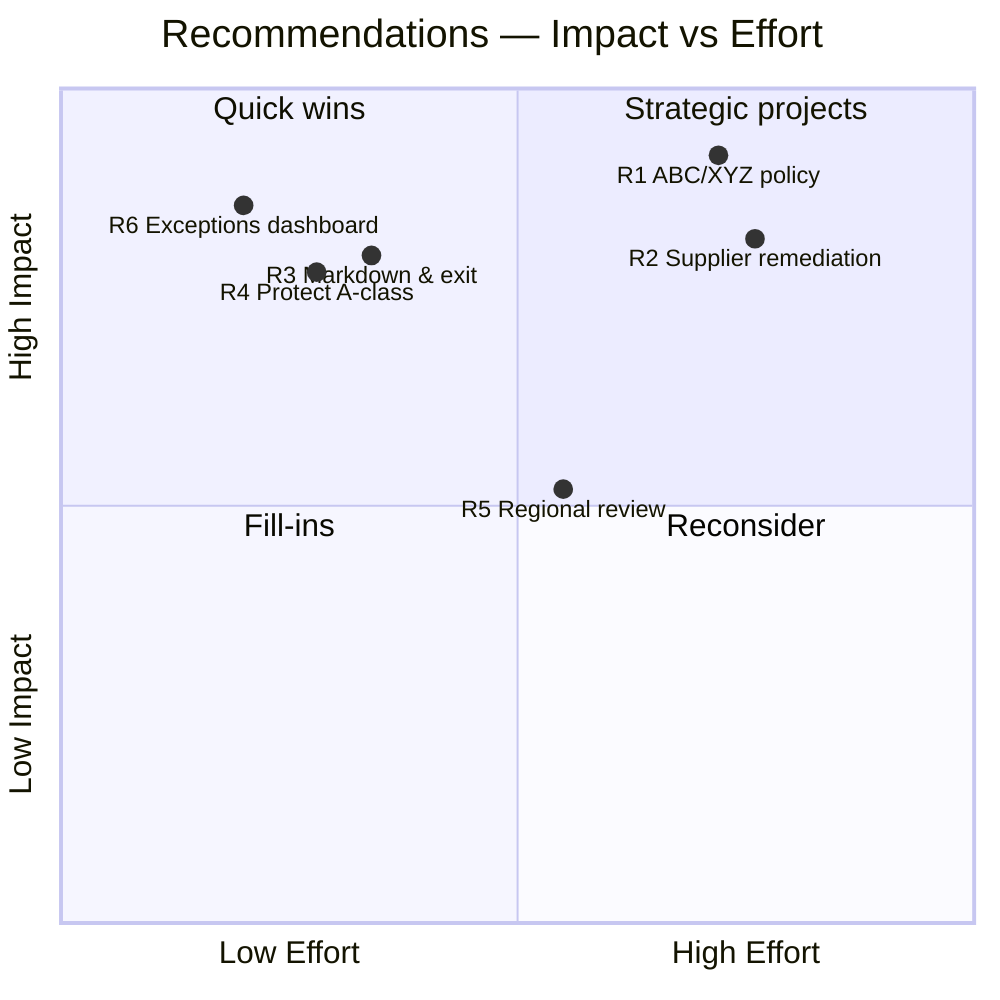

# Business Insights
## Retail Inventory Intelligence Platform (RIIP)

| Field | Value |
|---|---|
| **Document** | Business Insights & Recommendations |
| **Prepared for** | Meridian Retail Group — Executive Committee |
| **Prepared by** | BI Consulting *(portfolio case study, synthetic data)* |
| **Version** | 1.0 |
| **Date** | 26 July 2026 |
| **Basis** | Findings derived from the analysed RIIP dataset |

> All figures below are **read directly from the data** analysed in the previous sections, so every claim is traceable to a query. Forward-looking impact numbers are clearly labelled as estimates with stated assumptions.

---

## 1. Executive Summary

Meridian is a **healthy business with an inefficient balance sheet**. Gross margin is a strong **47%**, but the way inventory is bought and held is quietly costing the company on two fronts at once — trapped capital *and* lost sales.

Three numbers frame the opportunity:

- **~$729K of working capital is trapped** in dead and overstocked inventory — **36% of the entire inventory position**.
- **~$1.3M in sales is estimated lost to stock-outs** — revenue leakage that is roughly **2.5× the annual carrying cost** of holding inventory.
- **Inventory turns just 2.72× a year**, below the 3.0× target, because capital is tied up in the *wrong* stock.

The counter-intuitive finding — and the key to the whole engagement — is that Meridian is **overstocked and out-of-stock at the same time**. That combination is the signature of an *undifferentiated inventory policy*: the same buying rules applied to fast and slow movers alike. The single largest lever is not "buy less" or "buy more" — it is **buy differently by velocity, and fix the suppliers driving the stock-outs.**

A focused programme can realistically **release $300–450K of working capital** and **recover $400–520K of lost sales** within two to three quarters, while lifting turnover and supplier reliability toward target.

---

## 2. Problems (quantified)

| # | Problem | Evidence |
|---|---|---|
| P1 | **Capital trapped in overstock** | $583K in SKUs with >120 days of supply — **29% of inventory value** |
| P2 | **Dead inventory** | $146K in SKUs with no movement in 180 days — **7.3% of inventory** |
| P3 | **Revenue lost to stock-outs** | **~$1.3M** estimated lost sales; **2.8%** current stock-out rate |
| P4 | **Slow inventory turnover** | **2.72×** vs 3.0× target; ~134 days inventory outstanding |
| P5 | **Unreliable suppliers** | OTIF **69%** vs 85% goal; Bronze tier at just **48.8%** |
| P6 | **Unprofitable-to-hold stock** | **16.6%** of SKUs have **GMROI < 1.0** — they lose money to carry |
| P7 | **Regional imbalance** | South + East drive **~74%** of revenue; North + West lag materially |

---

## 3. Root Causes

Symptoms are cheap; causes are where the value is. The analysis links each problem to an underlying driver:

**Stock-outs are a *supplier* problem, not a buying problem.** Bronze-tier suppliers are only **18% of the supplier base** but are linked to **42% of current stock-outs**. Their OTIF is **48.8%** with high lead-time variability — and *variability*, not average lead time, is what defeats reorder points. When a supplier's delivery time swings unpredictably, no static reorder point can protect availability.

**Overstock comes from hedging against that same unreliability.** Buyers, burned by late deliveries, over-order to build a buffer — but they do it *uniformly*, so slow-moving C-class items accumulate months of cover. The absence of a **velocity-differentiated (ABC/XYZ) policy** means A and C items are managed with the same rules.

**Dead stock reflects no systematic exit process.** Discontinued and slow SKUs retain inventory because nothing triggers a markdown or liquidation when movement stops.

**Low turnover and low GMROI are downstream** of the above — capital is simply in the wrong stock.

**Regional imbalance** points to assortment and allocation not being matched to where demand actually is.

---

## 4. Business Insights

The patterns that change how leadership should think about the problem:

1. **Overstock and stock-outs coexist → the lever is *policy differentiation*, not volume.** Buying less would worsen stock-outs; buying more would worsen overstock. Segmenting by velocity fixes both.
2. **Availability is worth more than cost reduction.** Estimated lost sales (**$1.3M**) dwarf annual carrying cost (**$506K**). The bigger prize is *selling more*, not *holding less* — though the programme delivers both.
3. **Concentration is extreme and exploitable.** The top **20% of SKUs drive 68% of revenue**. Protecting A-class availability aggressively, while managing the long tail purely for cash, is the highest-ROI reallocation.
4. **The supplier tail is the leak.** Fixing or reallocating the **18% Bronze-tier** suppliers addresses **42%** of stock-outs — a small, targetable population with outsized impact.
5. **The trapped pool is large and releasable.** $729K is ~1.4 months of COGS sitting idle — a concrete, near-term cash opportunity.

---

## 5. Recommendations

| ID | Recommendation | Targets |
|---|---|---|
| R1 | **Implement ABC/XYZ-differentiated inventory policy** — tight service levels + lean safety stock on high-velocity/stable (AX) items; minimal cover on slow/erratic (CZ) items | P1, P4, P6 |
| R2 | **Supplier remediation programme** — OTIF-based scorecards, dual-source or re-tier the worst Bronze suppliers, and size safety stock to each supplier's *variability* | P3, P5 |
| R3 | **Structured markdown & exit programme** — a liquidation calendar for the $146K dead and worst of the $583K overstock | P1, P2 |
| R4 | **Protect A-class availability** — higher target service level and expedited replenishment on the 20% of SKUs driving 68% of revenue | P3 |
| R5 | **Regional allocation review** — rebalance assortment and stock toward demonstrated regional demand | P7 |
| R6 | **Operationalise the RIIP Exceptions dashboard** — daily reorder-now, stock-out, overstock, and late-supplier worklists as the standing operating rhythm | P1, P3 |

---

## 6. Priority Matrix

**Sequencing:** start with the **quick wins** (R6, R4, R3) — they release cash and protect revenue within weeks and require little more than the platform already built. Run the **strategic projects** (R1, R2) in parallel as the durable fix; they need process change and supplier negotiation but deliver the structural improvement. R5 follows once the core policy is in place.

---

## 7. Expected Business Impact

Estimates use conservative recovery assumptions against the measured baseline; they are planning figures to validate, not guarantees.

| Outcome | Baseline | Target (2–3 quarters) | Basis |
|---|---|---|---|
| Working capital released | $729K trapped | **$300–450K freed** | Clear dead stock + 50–65% of overstock via R1/R3 |
| Lost sales recovered | ~$1.3M lost | **$400–520K recovered** | 30–40% availability recovery via R2/R4 |
| Inventory turnover | 2.72× | **3.0–3.3×** | Trapped capital clears, COGS constant |
| Supplier OTIF | 69% | **80%+** | Bronze-tier remediation via R2 |
| Annual carrying cost | $506K | **−$75–110K** | Proportional to released inventory |

**Net framing for the board:** a programme built entirely on the RIIP platform — no new systems — targets roughly **$0.7–1.0M of combined annual value** (cash released + margin on recovered sales − carrying cost), with the quick wins self-funding the strategic work.

---

## 8. Reviews

**Senior BI Architect** — Every problem traces to a specific query and figure; root causes are argued from the data (Bronze-tier → 42% of stock-outs), not asserted. *Strengthened:* separated *lost sales* from *carrying cost* to show availability is the larger prize — a sharper insight than a generic "reduce inventory."

**Hiring Manager** — This section demonstrates the thing that actually gets a BI candidate hired: turning numbers into a decision. The "overstocked *and* out-of-stock simultaneously" insight is a memorable, defensible talking point. *Strengthened:* a priority matrix with sequencing, so it reads as an executable plan, not a list.

**Freelancing** — An insights-and-recommendations report is the highest-value deliverable a BI consultant sells; this is a complete, board-ready example grounded in real analysis.

---

*End of Business Insights v1.0.*
